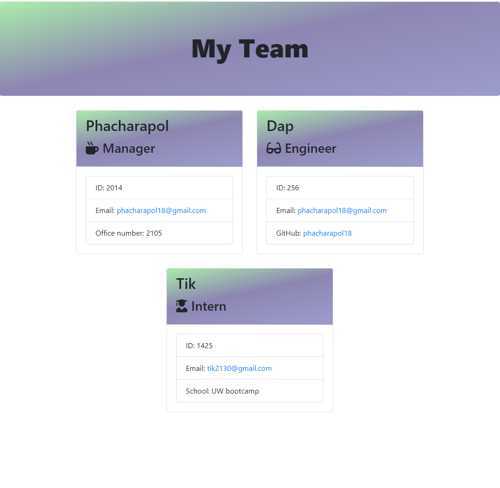

# Team Profile Generator 

    
    User will be able to generate their team for easier contact.
## Table Contents
  - [Installation](#installation)
  - [Usage](#usage)
  - [Contributing](#contributing)
  - [Test](#test)
  - [Question](#question)

## Installation
    Clone this repositories
    Install Node.js
    npm init
    npm i

## Usage
    JavaScript
    npm inquirer package
    VScode Editor
    node.js
    
   

## Contributing
    In this project All User can help improve this app and make it your own with your own design.

## Test

<video  width="445" height="300" controls
 src="images-videos/demo.mp4" type="video/mp4">
</video>
Link: https://drive.google.com/file/d/14QyBVuLEQBodkHm-FJNyKfhdopZ3CDOc/view

## Question
- Github: [phacharapol18](https://github.com/phacharapol18)
- <a href = "mailto:phacharapol18@gmail.com" target = "_blank">phacharapol18@gmail.com</a>
### Thank you